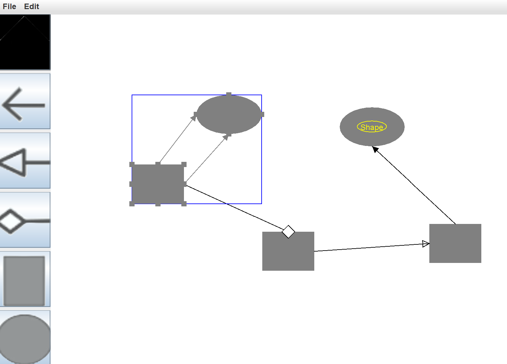

# UML Editor
## Introduction
This is the final project of NCU Object-Oriented Analysis and Design, a simple UML editor developed by Java Swing.



## Features
- Select Objects
- Drag to Move the Objects
- Create Objects (Oval and Rectangle)
- Create Links on Objects (Association, Generalization, Composition)
- Group Objects
- Label Objects (Name, Label Shape, Color and Font Size)

## How to use

Install Java and use the following commands (for Windows user):

```
cmd> java Main.java
```
